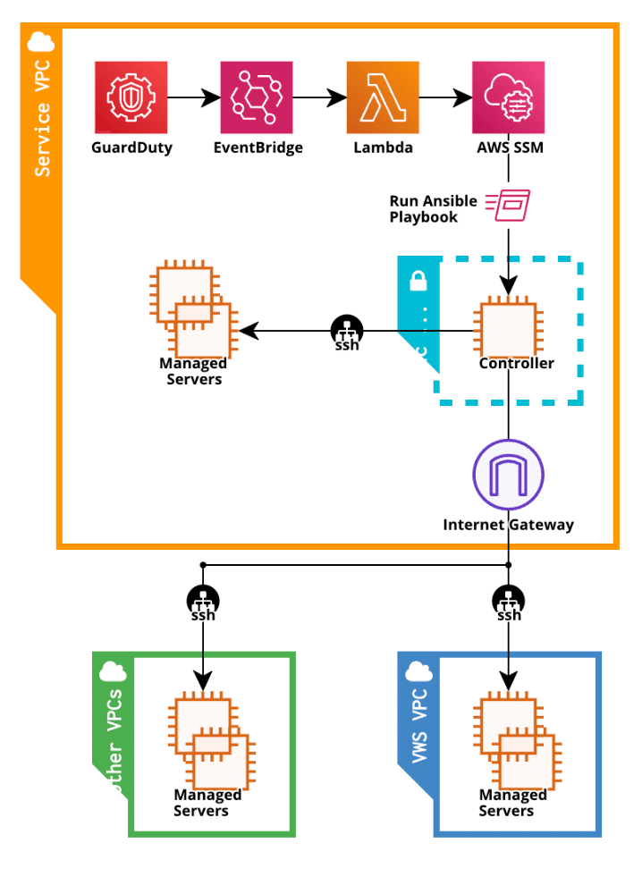

# GuardDuty Ansible iptables

## 프로젝트 개요

### 어떤 기능을 수행하는가

- GuardDuty에서 감지된 VPC내의 의심되는 통신기록 로그를 Lambda로 분석하여 SSM의 RunCommand 기능을 통해 Ansible 컨트롤러의 플레이북(플레이북은 타겟의 iptables에 접근제어를 수행)을 실행함

### 사전 조건 (프로젝트에서 다루지 않는 부분)

- VPC내에 GuardDuty를 활성화  
  [Getting started with GuardDuty](https://docs.aws.amazon.com/guardduty/latest/ug/guardduty_settingup.html)
- Ansible Controller Instance에는 SSM Agent, Ansible을 설치하고, 각 호스트에 대한 연결이 수립되어 있음  
  [Working with SSM Agent on EC2 instances for Linux](https://docs.aws.amazon.com/systems-manager/latest/userguide/sysman-install-ssm-agent.html)  
  [How to install Ansible on AWS EC2 Amazon Linux 2 instance](https://devcoops.com/install-ansible-on-aws-ec2-amazon-linux/)  
  [Ansible Documentation](https://docs.ansible.com/)
- NodeJS에 대한 코딩 지식
- AWS EventBridge, Lambda의 동작 방식에 대한 이해
- Terraform HCL에 대한 코딩 지식 및 동작 방식에 대한 이해

### 구성도

